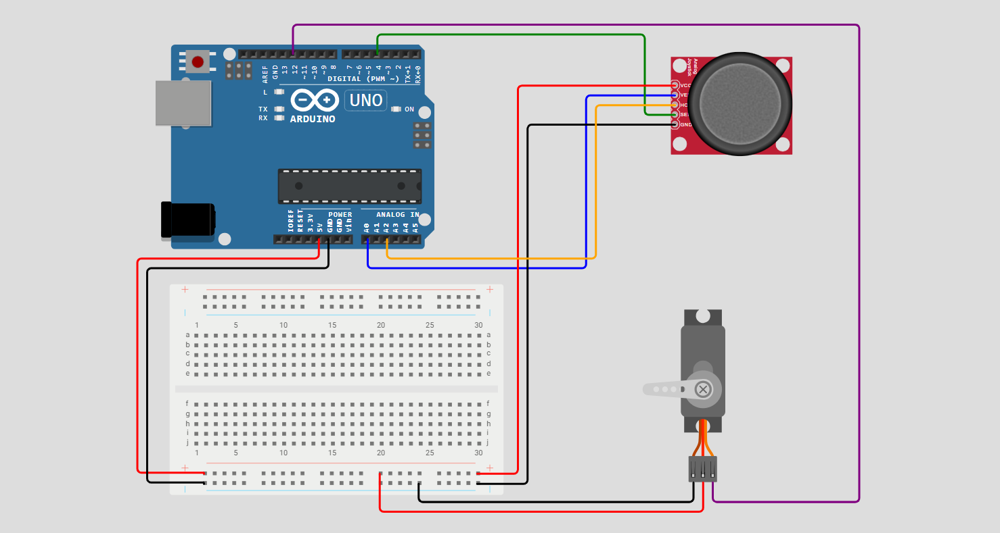

# Projeto Garra Robótica

Este projeto consiste em um estudo prático do funcionamento de um módulo joystick e de um micro servo motor. Na prática, foi utilizada uma garra robótica aclopada ao servo, que pode abrir e fechar de acordo com os comandos no joystick.

  
 

Há dois tipos de movimentos possíveis para a garra: movimentos de abertura e fechamento dinâmicos e movimentos de abertura e fechamento fixos. Ao mover o joystick no sentido vertical, a garra realizará movimentos não fixos, voltando ao estado padrão sempre que o joystick for solto. Já ao realizar movimentos horizontais, a garra alterará seu ângulo de abertura e se manterá fixa até que o botão do joystick seja pressionado.

---
## Componentes utilizados
  - Arduino Uno (1x)
  - Módulo Joystick (1x)
  - Garra Robótica Ant (1x)
  - Micro Servo 9 g (1x)
  - Protoboard (1x)
  - Jumpers

---
## Esquemático do Circuito

  

 

**Legenda:**
  - D4 -> Joystick (SW)
  - D12 -> Micro Servo (Linha de Sinal PPM)
  - A0 -> Joystick (VRX)
  - A2 -> Joystick (VRY)
  - 5 V -> Joystick (VCC)
  - 5 V -> Micro Servo (VCC)

---
## Montagem e Funcionamento

  

 

🎥 **Vídeo do Funcionamento:**  
👉 [Acesse clicando aqui!](https://youtu.be/SsBZyDw)

---
## Código do Projeto
Quer ver como esse projeto foi programado?  
👉 [Acesse o código clicando aqui!](garra-robotica/garra-robotica.ino)
